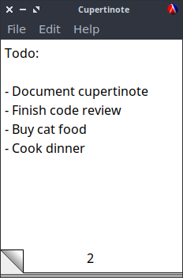

# cupertinote - simple notepad



Cupertinote is a simple notepad with a skeumorphic design. It looks and behaves
rather like its direct inspiration, the notepad applet provided with classic
versions of Mac OS (ranging back to I believe System 7).

## Installation

You need [Racket](https://racket-lang.org) installed.  Once it is, Cupertinote
has one dependency,
[string-searchers](https://pkgs.racket-lang.org/package/string-searchers), which
can be installed with raco:

```bash
raco pkg install string-searchers
```

A standalone executable can be built as such:

```bash
raco exe cupertinote.rkt

# linux
raco distribute cupertinote-bin cupertinote

# windows
raco distribute cupertinote-bin cupertinote.exe

# macos
raco distribute cupertinote-bin cupertinote.app
```

## Copying

Cupertinote is Copyright (C) japanoise 2024, licensed under the terms of the GPL
version 3, or at your option any later version.
